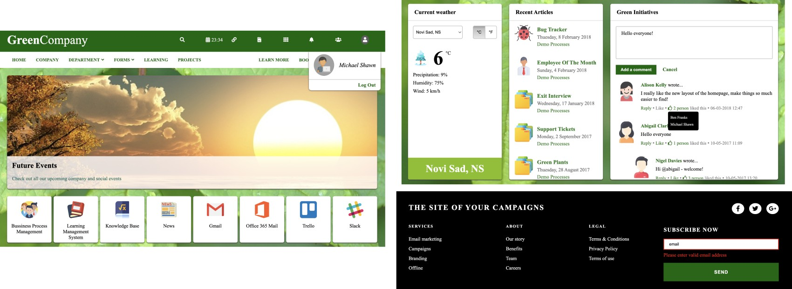
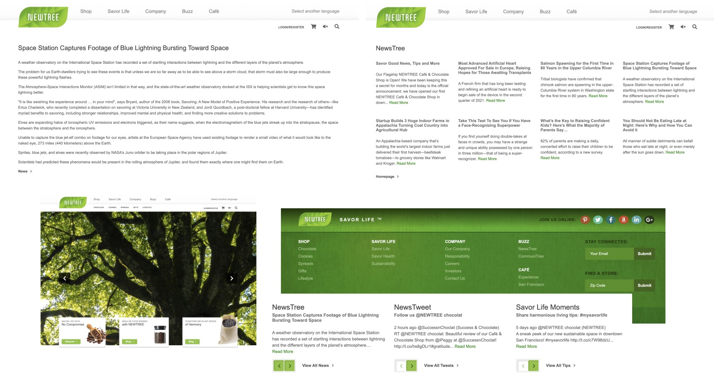
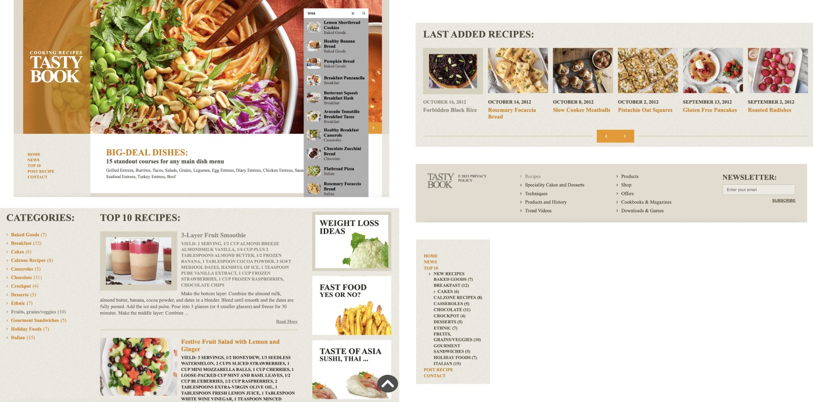
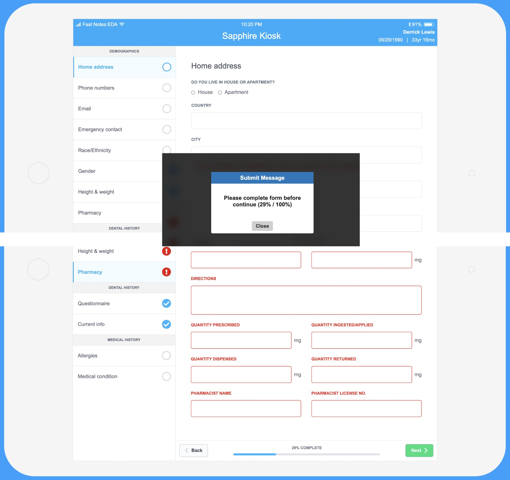
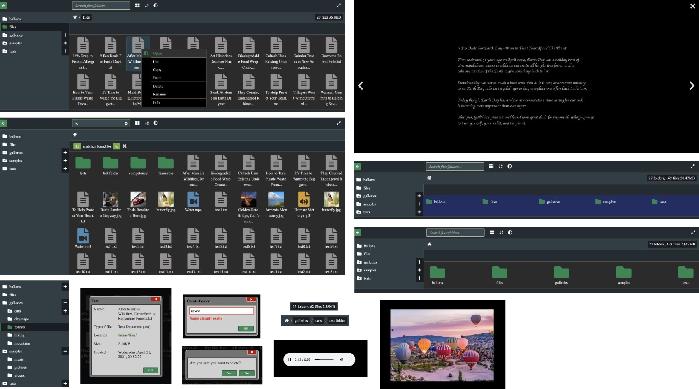

# Vanilla javascript repository

Following examples use vanilla javascript to create interactive web pages and single page applications. There are examples where jQuery is used along with javascript.

For given examples local web server must be used because of local HTTP get requests (AJAX). Any web server can installed: MS IIS, Nginx, Apache or other server. Get requests are called for retrieving local static data in json format from web server, to be handled on the client side as "backend data". All pages are pure client side and that's the reason why static json data is used.

## Setup web server

### _How to install web server_

For example, to install local Nginx web server on Mac type command in terminal for installation using _Homebrew_ package manager:

```shell
brew install nginx
```

### _*How to copy files to the local web server*_

If Nginx web server is installed, then on Mac operating system default public server root folder is located in _/opt/homebrew/var/www/_. Copy project folder to root folder.

### _How to run web server_

To run local Nginx web server on Mac type command in terminal for running local server:

```shell
brew services start nginx
```

Once it is run, it will be automatically started when system is reboot.

### _How to see if web server is running_

To see if Nginx web server is already running on Mac, type command in terminal:

```shell
brew services list
```

If there is process named _nginx_ in printed services list, then Nginx web server is running.

### _How to stop web server_

To stop web server for any reason, then type command in terminal:

```shell
brew services stop nginx
```

### _How to open html pages on web server_

Type in browser url address _http://localhost:8080/<project_folder>_, where _<project_folder>_ is name of the project folder (in this case full address is _http://localhost:8080/js_repo/_). Project folder must be copied to the root folder of the web server. See [link](#how-to-copy-files-to-the-local-web-server) for details. Nginx server default port is _8080_.

## Pages

Following examples are using plain vanilla javascript along with HTML, CSS, SCSS.

### Example 1

On page header there is logged user with name. On the center, there are three sections. First section is for measuring current weather for main cities in both C/F. Second section contains list of articles. Third section is chat with comments history, reply, like and nesting comments. When like button is clicked, list of names who liked comment appears. Email box with validation is placed inside footer and when valid email is sent, then message for current username is rendered.

Link to [example](https://github.com/pancogit/js_repo/tree/master/primeri/primer1).



### Example 2

Homepage have header with menu items, image slider with left and right arrows for changing images. Also images are automatically changed on timer. Center of page contains three sections: news, tweets and tips. Arrows for each of these section dynamically change article. There is also read more link to redirect to the page with given article and link to the list of all articles for given section. Footer validates email and zip code which can be submitted.

Link to [example](https://github.com/pancogit/js_repo/tree/master/primeri/primer2).



### Example 3

In this example there is header with clickable dropdown menu, page content with card images and search form. Form has category, state and city of choice. When category is selected, then appropriate states are listed. When state is selected, then cities for given state are listed. On the page bottom, there is list of news which can be expanded with button.

Link to [example](https://github.com/pancogit/js_repo/tree/master/primeri/primer3).


### Example 4

Slider with images in header is updated on timer or with arrows controls. Search box implements live search feature for all recipes on website. Menu is below header with top 10 group of recipes and for every selected group, category from page content menu is changed also. Last added recipes section contains recipes sorted by latest time and each group can be changed with navigation arrows. Categories of recipes can be selected from the submenu and top 10 recipes are listed next to them. Each recipe has link for expanding text or hiding it. On the bottom there is link for all recipes of given group. Footer contains email validation and subscribe.

Link to [example](https://github.com/pancogit/js_repo/tree/master/primeri/primer4).



### Example 5

Forms for medical conditions have many sections (groups) on left side as menu. When menu item is marked sign blue, then all questions for given group are filled. Otherwise, if any questions are not filled, then red marker is rendered and all missed ones are bolded with red. All filled informations from all groups are saved, so any time they can be finished. On the bottom, there are progress bar with percentage of total filled answers from all groups, back and next buttons. For last group of questions, there is finish button instead of next and if it's clicked but not all answers are filled, popup message appears that says all forms must be completed first. Otherwise, forms data are send and forms cleared. On page top in the middle, there is digital watch with current system time and it's updated in real time. On the top right, battery with levels is decreased over time in random way.

Link to [example](https://github.com/pancogit/js_repo/tree/master/primeri/primer5).



### Example 6

File system as web app is implemented with the most important and used features. List of all home folders are on the left side with pluses if there are subfolders inside them. Folders can be expanded or hidden from that view. Breadcrumbs are following current directory path and by clicking on them, path can be reversed. On the right side there are number of folders, files and total size of current directory. Folder content is rendered on the center with all files and subfolders. All standard files / folders operations are supported: open, cut, copy, paste, delete, rename, info. All standard kind of files are supported: text, images, videos and music files. Info operation shows name of file, extension, location, size and when it's created. Popup window with operations can be opened with right mouse click. New files and folders can be created also, but the same names in the current folder are not allowed. On the top, there is search box with live search implemented and total number of matched names are counted. There are three more icons next to it. First is used for changing files icons size, second for sorting files in current directory and third for changing files background themes. On the top right, there is button for maximize / minimize window.

Because right click is used for popup window, it is not possible to trigger right click properties with a mouse to inspect developers tools. For that kind of purpose, please use keyboard shortcuts.

Link to [example](https://github.com/pancogit/js_repo/tree/master/primeri/primer6).


